# Digital-Product-School-Challenge

## Visualization:

### Violin Plots for each accident category
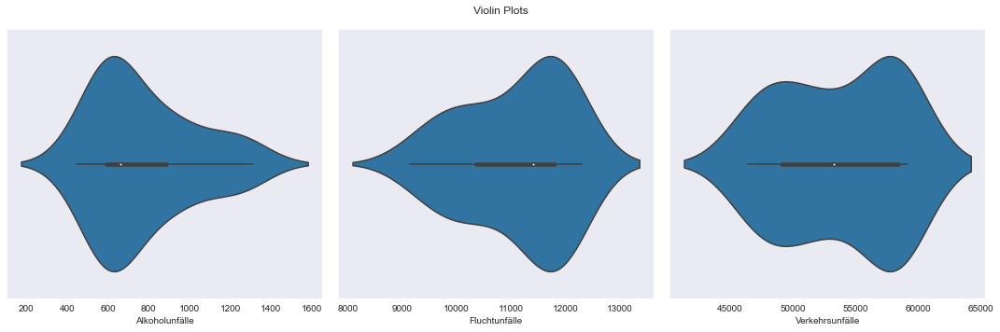
 
### Line Plots of the number of accidents for each accident category 
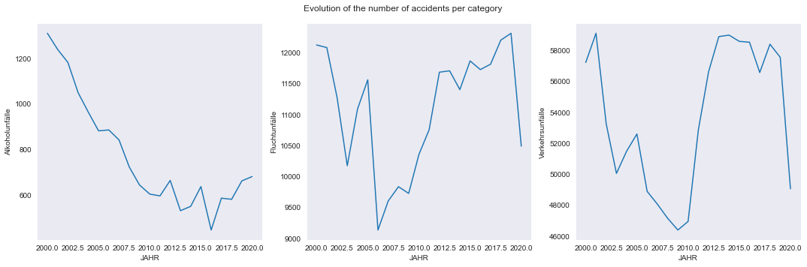
 
### Bar and Histogram Plot for the number of accidents per category
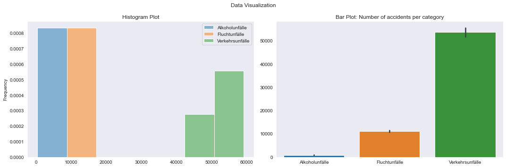
 
### Trend and Season Plots
#### Alkoholunfälle
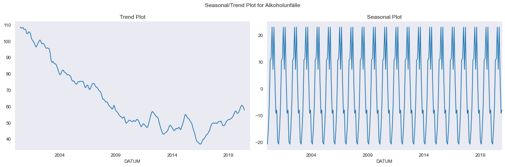
 
#### Fluchtunfälle
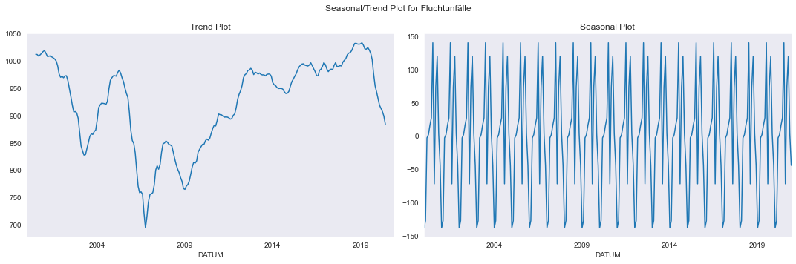
 
#### Verkehrsunfälle
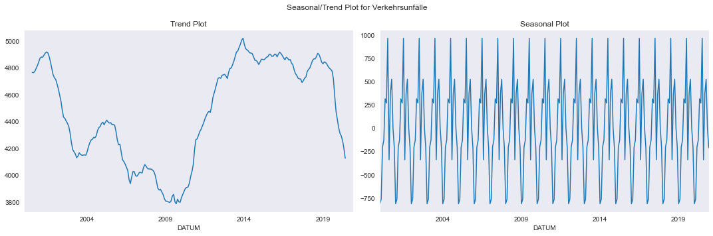
 
### Trainning Summary:
#### Alkoholunfälle
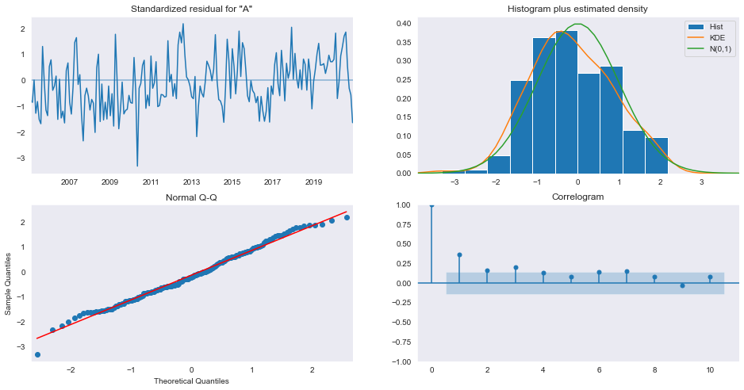
 
#### Fluchtunfälle
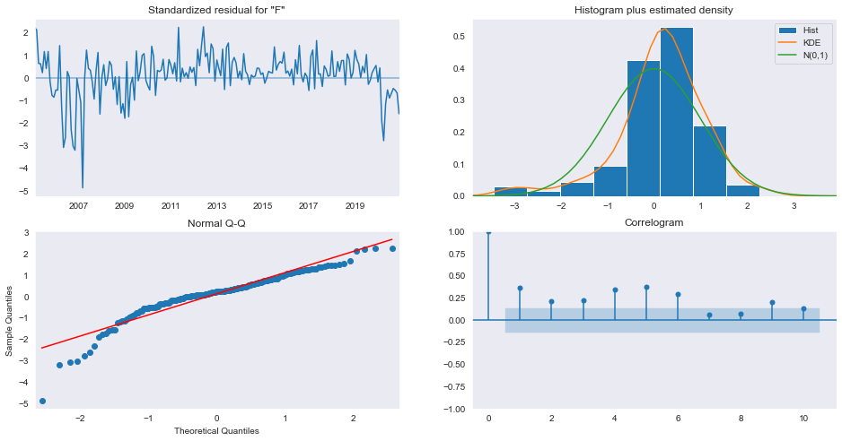
 
#### Verkehrsunfälle
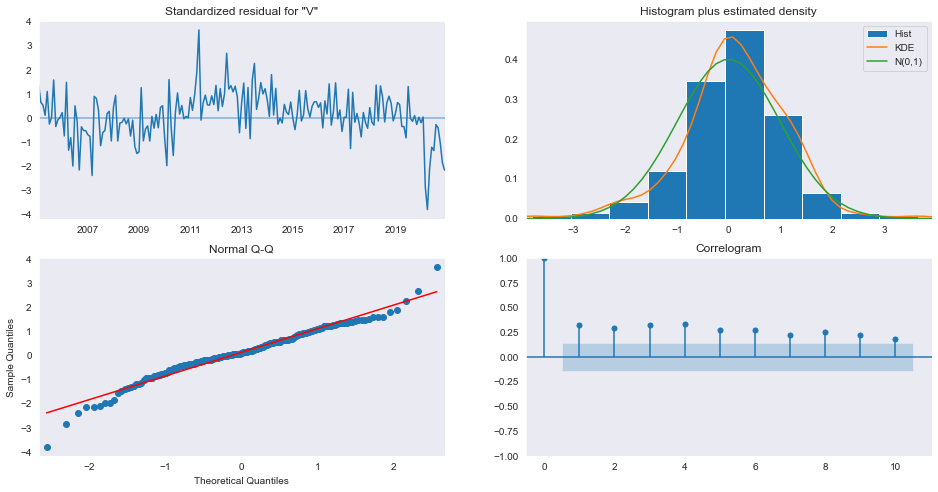
 
### Prediction and Validation
#### Alkoholunfälle
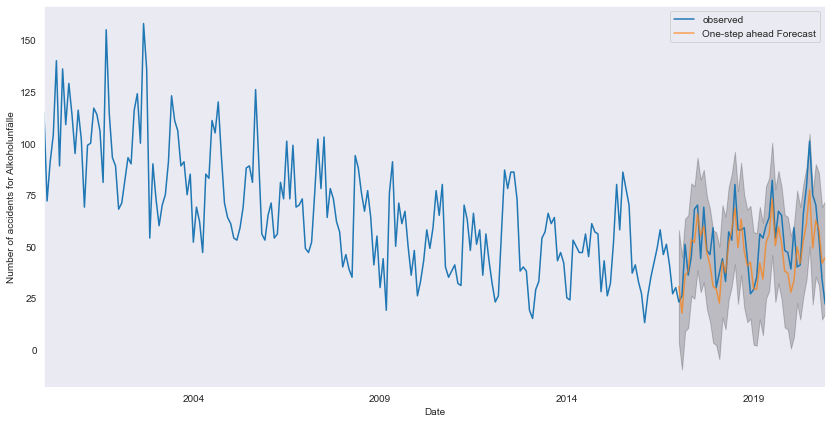
 
#### Fluchtunfälle
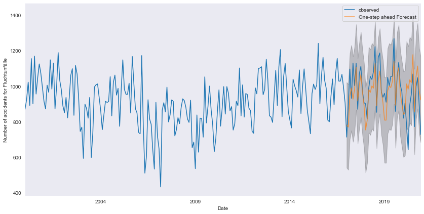
 
#### Verkehrsunfälle

 
### Prediction 2021
#### Alkoholunfälle
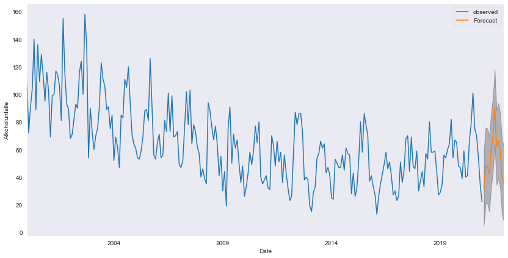
 
#### Fluchtunfälle
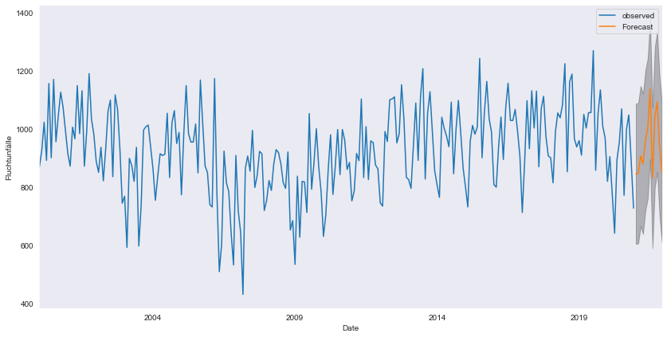
 
#### Verkehrsunfälle
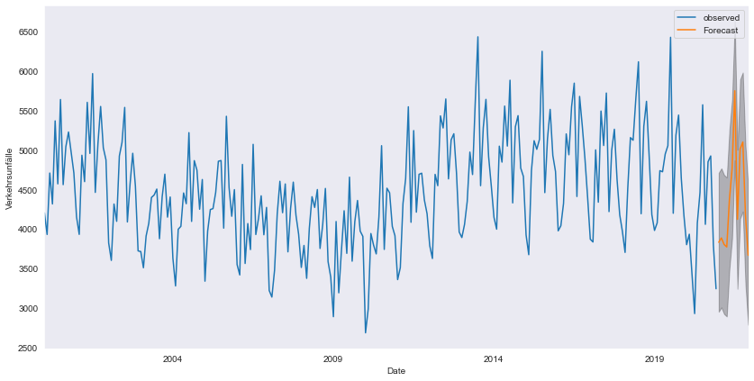
 